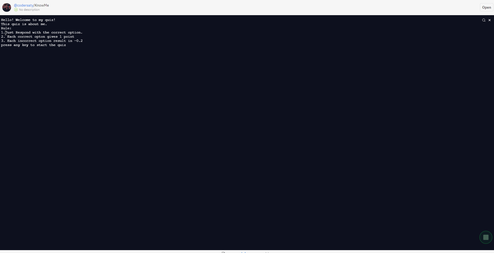

<h1 align="center" id="top">Welcome to Quiz on Me 👋</h1>

# Basic Overview

> This project is a simple Command Line Interface (CLI) Application to take a quiz on your friend codersaty (me 😅😅).

 

# Table of Contents

- [Description](#description)
- [Technologies Used](#technologies)
- [How to use](#How-to-use)
- [References](#references)
- [License](#license)
- [ToDos](#To-Dos)
- [Related Projects](#related-projects)
- [Support](#support)
- [Author Info](#author-info)

 

# Description

A simple and easy to use Command Line Interface (CLI) app used to test how much my friend know about me by taking simple quiz using technologies like repl.it, nodejs and javascript.

[Live Demo](https://replit.com/@codersaty/KnowMe?embed=1&output=1)

 

# Technologies

- [JavaScript](https://en.wikipedia.org/wiki/JavaScript)
- [Git](https://en.wikipedia.org/wiki/Git)
- [Markdown](https://en.wikipedia.org/wiki/Markdown)
- [Nodejs](https://en.wikipedia.org/wiki/Node.js)

### Tools used

- [VS Code](https://en.wikipedia.org/wiki/Visual_Studio_Code)
- [Github](https://en.wikipedia.org/wiki/GitHub)
- [Repl(dot)it](https://en.wikipedia.org/wiki/Replit)

 

# How to Use

- Hit the play button on bottom right corner.

- Read the instrution on the CLI app.

- Play the Quiz and check your score.

# References

I have used the following resources in creation of this project:

- [First CLI App: Intro to programming](https://www.youtube.com/watch?v=_L-UszPmy2A&list=PLzvhQUIpvvuj5KPnyPyWsvgyzNkX_ACPA&index=2)

 

# License

[MIT License](LICENSE.md)

Copyright (c) 2021 @[codersaty](http://codersaty.me)

 

# To Dos

> Thinking About it.

 

# Related Projects

> I will add the projects soon.

 

# Support

In case of any problem/ query, feel free to do pull requests or contact the author.

 

# Author Info

- Twitter - [@codersaty](https://twitter.com/codersaty)
- Website - [Anuranjan Srivastava](http://codersaty.me)
- Linkedin - [codersaty](https://www.linkedin.com/in/codersaty)

 

[Back To The Top](#top)